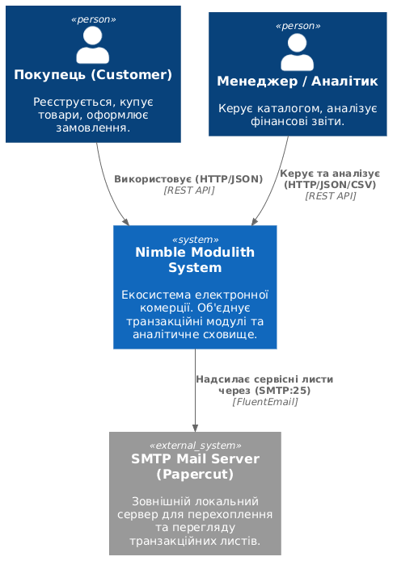
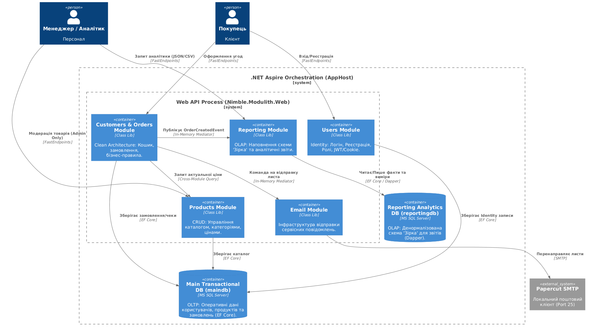
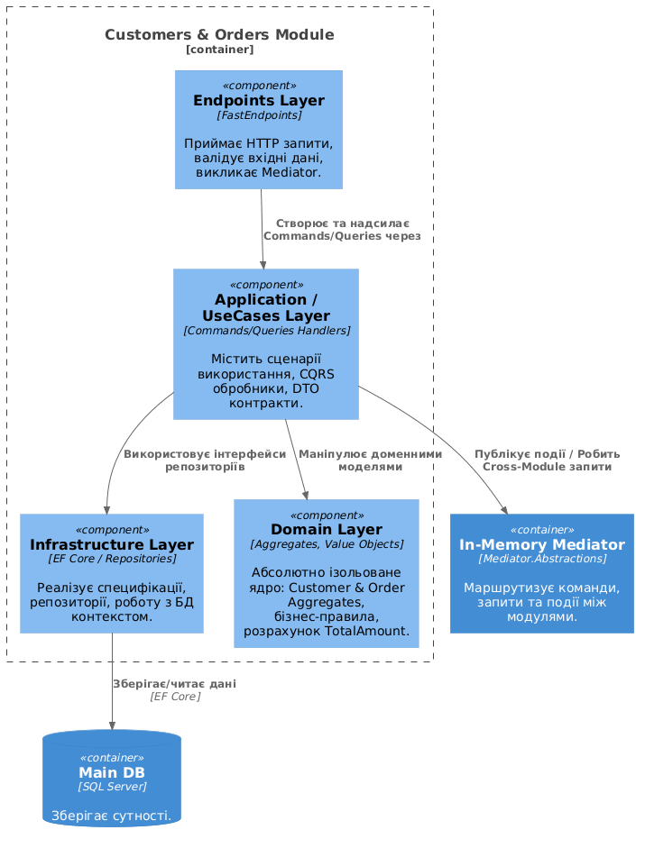

# Екосистема Електронної Комерції: Модульний Моноліт з OLAP-Аналітикою
## Звіт про виконання практичного курсу (Лабораторні роботи 1–7)
**Варіант: 2.4** (Впишіть сюди номер вашого варіанту)

---

## 🏗️ Опис проекту та Архітектурний паттерн

Цей проект є комплексною корпоративною системою для управління інтернет-магазином, побудованою на базі архітектури **Модульного Моноліту (Modular Monolith)** на платформі **.NET**. 

Додаток розгортається і функціонує як єдиний високопроцесний веб-сервіс, проте його внутрішня кодова база строго декомпонована на ізольовані доменні модулі (Class Libraries). Кожен модуль спроектовано з урахуванням суворого розмежування контекстів (Bounded Contexts) та інкапсуляції даних. Взаємодія між ними відбувається виключно через слабкопов'язані **публічні контракти (Contracts)**, асинхронні запити та **внутрішньопроцесні події (In-Memory Mediator)**, що унемовичлює появу жорстких залежностей.

Система оркеструється за допомогою **.NET Aspire**, який автоматично керує контейнерами баз даних та надає централізовану панель моніторингу (Dashboard).

---

## 🛠️ Огляд реалізованих модулів (Еволюція ЛР 1–7)

### 1. Модуль Користувачів (`Nimble.Modulith.Users`) — *ЛР 1, 2, 5, 6*
- Забезпечує процеси автентифікації та авторизації на базі **ASP.NET Core Identity** та системних сервісів `UserManager`/`SignInManager`.
- Реалізує захист кінцевих точок за допомогою кук (Cookie) та безпечних JWT-токенів.
- Керує ролями (`Admin`, `Customer`) та надає функціонал автоматичної безпечної генерації тимчасових паролів (на основі перших 12 символів `Guid`).

### 2. Модуль Продуктів (`Nimble.Modulith.Products`) — *ЛР 3, 5, 6*
- Реалізує швидкий CRUD-інтерфейс (створення, читання, оновлення, видалення) для каталогу товарів за допомогою `ProductsDbContext`.
- Включає рольовий захист: операції модифікації товарів доступні виключно користувачам із роллю `Admin` за допомогою декларативного методу `.Roles("Admin")`.
- Надає публічний контракт `GetProductPriceQuery` для кросмодульної перевірки вартості товарів іншими доменами.

### 3. Модуль Клієнтів та Замовлень (`Nimble.Modulith.Customers`) — *ЛР 4, 5, 6, 7*
- Спроектований за принципами **Clean Architecture (Чиста архітектура)** та **DDD (Domain-Driven Design)**. Розділений на чотири внутрішні шари: `Domain` (ізольоване ядро), `UseCases (Application)`, `Infrastructure`, `Endpoints`.
- Реалізує бізнес-логіку за допомогою патерну **CQRS (Mediator)**, розділяючи операції запису (Commands) та читання (Queries).
- Використовує багаті доменні моделі (Rich Domain Models) з інкапсульованими колекціями, guard-клаузами для захисту інваріантів та автоматичним розрахунком суми замовлення (`TotalAmount`).
- **Безпека ціноутворення (ЛР 6)**: Замовлення не приймають ціну від клієнта. Модуль виконує міжмодульний запит через Mediator до модуля `Products` для отримання актуальної ціни з бази даних, захищаючи систему від маніпуляцій.
- Впроваджено новий проміжний статус замовлення `Confirmed` для безпечного старту процесу аналітичного інжестування (Ingestion).

### 4. Модуль Сповіщень (`Nimble.Modulith.Email`) — *ЛР 5, 6*
- Інфраструктурний модуль для автоматичної розсилки сервісних повідомлень за допомогою бібліотеки `FluentEmail`.
- У режимі розробки інтегрований із локальним SMTP-сервером **Papercut**, що перехоплює транзакційні листи (вітальні листи з тимчасовим паролем для нових клієнтів, підтвердження замовлень, посилання на відновлення доступу).

### 5. Аналітичний модуль звітності (`Nimble.Modulith.Reporting`) — *ЛР 7*
- Реалізує аналітичне сховище даних (**OLAP**) окремо від операційної бази даних (**OLTP**), мінімізуючи навантаження на систему під час важких запитів.
- **Схема «Зірка» (Star Schema)**: Таблиця фактів `FactOrders` містить ключі та фінансові метрики, оточена денормалізованими таблицями вимірів `DimCustomer`, `DimProduct` та `DimDate` (автоматично засіюється календарем на 2025 рік).
- **Event-Driven Data Ingestion**: Обробник подій `OrderCreatedEventHandler` асинхронно перехоплює внутрішньопроцесні події `OrderCreatedEvent`. Він працює за принципом ідемпотентності, запобігаючи дублікатам за допомогою унікального індексу на композитному бізнес-ключі `(OrderId, OrderItemId)`.
- **Гібридне використання ORM**: Запис даних та верифікація вимірів здійснюється через **EF Core**, а аналітичні вибірки (агрегації, групування `GROUP BY`, підрахунок середнього чеку) виконуються через високошвидкісний мікро-ORM **Dapper**.
- **Динамічний експорт**: Кінцеві точки на базі **FastEndpoints** аналізують HTTP-заголовки `Accept: text/csv` або query-параметри `?format=csv` і автоматично трансформують JSON у формат CSV для відкриття в MS Excel.

## ⚙️ Технологічний стек проекту

- **Платформа**: .NET 8 / .NET 9
- **Веб-архітектура API**: FastEndpoints (Патерн REPR - Request-Endpoint-Response)
- **Оркестрація та Контейнеризація**: .NET Aspire, Docker Desktop
- **Бази даних (СУБД)**: MS SQL Server (Два окремих інстанси: `maindb` та `reportingdb`)
- **Доступ до даних**: Entity Framework Core + Dapper (Гібридний підхід)
- **Внутрішньомодульна комунікація**: Mediator (In-Memory)
- **Логування та Метрики**: Serilog, OpenTelemetry (вбудовано в Aspire)
- **Тестування пошти**: FluentEmail + Papercut (локальний SMTP)

---

## 🗺️ C4 Архітектурні діаграми системи

*(Графічні файли діаграм розміщені в папці `/docs` у репозиторії)*

### Рівень 1: Системний контекст (System Context)
Показує взаємодію користувачів (Покупців та Менеджерів) із монолітною екосистемою та зовнішньою системою перехоплення пошти.


### Рівень 2: Контейнери системи (Container Diagram)
Відображає оркестрацію процесів у середовищі .NET Aspire, розділення баз даних та ізоляцію логічних модулів всередині єдиного Web-хосту.


### Рівень 3: Компоненти модуля Customers (Component Diagram)
Показує внутрішню структуру Clean Architecture шарів (Domain, UseCases, Infrastructure, Endpoints) для модуля Customers та їхню роботу з Mediator.


---

## 📁 Структура рішення (Solution Tree)

```text
├── Nimble.Modulith.slnx                 # Файл рішення нового XML-формату .NET
├── Directory.Build.props               # Спільні правила компіляції та попереджень
├── Directory.Packages.props            # Централізоване керування версіями NuGet пакетів (CPM)
│
├── Nimble.Modulith.AppHost/            # Оркестратор .NET Aspire (налаштовує контейнери maindb та reportingdb)
├── Nimble.Modulith.ServiceDefaults/    # Спільні метрики OpenTelemetry, логування та Health Checks
├── Nimble.Modulith.Web/                # Головний хост-проект (ASP.NET Core Web API, що збирає всі модулі)
│
├── Nimble.Modulith.Users/              # Модуль користувачів +його контракти (.Users.Contracts)
├── Nimble.Modulith.Products/           # Модуль продуктів (CRUD) +його контракти (.Products.Contracts)
├── Nimble.Modulith.Email/              # Модуль відправки пошти (FluentEmail) +його контракти
│
├── Nimble.Modulith.Customers/          # Модуль замовлень за Clean Architecture (Domain, UseCases, Infrastructure)
├── Nimble.Modulith.Customers.Contracts/# Публічні контракти та події (OrderCreatedEvent)
│
└── Nimble.Modulith.Reporting/          # Аналітичний модуль (Зіркова схема, EF Core + Dapper, CSV-експорт)